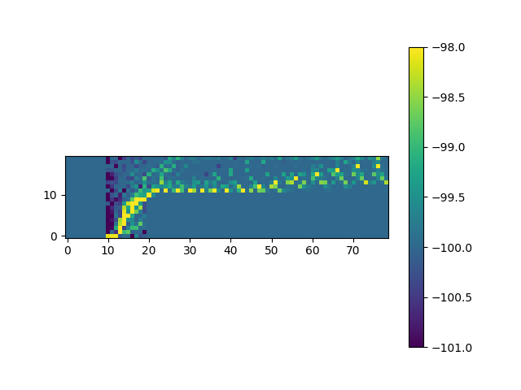
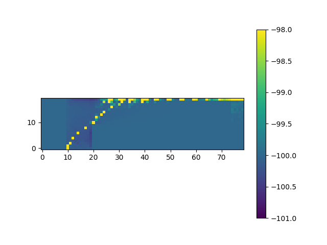

# e-Greedy Monte Carlo

- Solution is often way off optimal
- Often converges to a value worse than optimal
- Sensitive to initial conditions
- Setting initial Q too small means policy rarely explores new states if there’s an option to go to a known state -> policy is suboptimal 
- Setting initial Q too large means policy frequently explores new states when there’s an option to go to an unknown state -> policy converges very slowly, doesn’t care even when a decent solution is found.

# SARSA Semi-gradient

- Works significantly better than MC.
- Converges faster and to a better solution.
- Comparing state diagrams, MC explores alternate paths unevenly.
SARSA explores alternate paths evenly.
- When an MC alternate fails to get to the end, earlier parts of the path are heavily negatively reinforced because they occurred early and we wait until the end of the episode to apply updates.
- When an MC alternate succeeds in getting to the end, it gets heavily positively reinforced because the state values of that alternate only improve - keeps taking the same actions on subsequent episodes.
- This leads to high-variance, inaccurate estimations of alternates.
- In SARSA, alternate path states are updated the same way regardless of failure or success, until success state values from the end of the track propagate backward.
- This means state values are not estimated prematurely.
- Because SARSA updates throughout the episode, alternate paths don’t get heavily traversed run-after-run until (well-known) success state values propagate backward.
