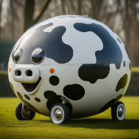
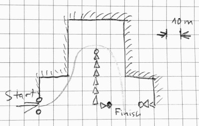

# Spherical Car Racing

You might have heard the terms
"[spherical cow](https://en.wikipedia.org/wiki/Spherical_cow)"
or "spherical horse" as a way to simplify a complex concept to illustrate some
point without unnecessary details.

As car racing is one of my passions, I figured why don't we try racing spherical
cars, and learn something along the way?

## Prerequisites

You should have solid beginner-level understanding of Python to be able to program
your "driver". You can try one of the free Python courses, such as
[one](https://www.mathplanet.com/education/programming)
[of](https://www.coursera.org/professional-certificates/google-it-automation)
[these](https://www.udemy.com/course/math-with-python/).

Basic understanding of school level physics is recommended.

Very basic understanding of Git commands such as
[`git clone`](https://docs.github.com/en/repositories/creating-and-managing-repositories/cloning-a-repository)
and
[`git pull`](https://docs.github.com/en/get-started/using-git/getting-changes-from-a-remote-repository)
is required to get the source code and keep it up to date.

It's recommended to
[install the Pillow library](https://pillow.readthedocs.io/en/stable/installation.html)
so that you can get nice graphs to simplify debugging your racers.

Before participating in any race, please make sure you have the latest version
of this repository by running `git pull`. The race setups and descriptions might
get improved/clarified over time, as well as updated in case new records are set.
Some races may also be removed in case they are proved to be incorrect / too ambiguous.

## Race 01

Race 01 is a simple 1-mile start-and-stop race.
This is a very simple race, the main purpose here is to let people learn how to
race a spherical car by writing code in Python :)

Open [`race_01.py`](race_01.py) and read the comment at the start of the file
for rules and tips on how to proceed.

## Race 02

Race 02 is a simple 100-meter straight line course where the only limiting
factor is that your car has to drive slower than 30 m/s at the finish line.
In this race you might learn something interesting and counter-intuitive.

Open [`race_02.py`](race_02.py) and read the comment at the start of the file
for rules and tips on how to proceed.

## Race 03

Race 03 is our first 2D race, and it looks like a small autox course:

Open [`race_03.py`](race_03.py) and read the comment at the start of the file
for rules and tips on how to proceed.

The provided naive solution uses a "karting" line, but the fastest line will
be much more interesting. Once you find the optimal solution, compare the
speed-vs-distance graph of the naive solution with the same graph for the
optimal solution. You will notice that even such a simple 2D spherical car model
requires some "driving techniques" that are typically believed to be needed only
for much more complex 3D effects...

## Race 04

This takes the idea of Race 03 and takes a few more cones to make it look like
an autox slalom. The optimal solution for this race is a bit tedious, so feel
free to skip to Race 05 if you prefer.

Open [`race_04.py`](race_04.py) and read the comment at the start of the file
for rules and tips on how to proceed.

## Race 05

We're getting back to the basics, and racing a simple "straight, 90º corner,
straight" course:

Sounds simple? But the optimal solution will likely be pretty complicated!
Or interesting, rather?

Open [`race_05.py`](race_05.py) and read the comment at the
start of the file for rules and tips on how to proceed.

## Race 06

We take the course design from Race 05 and take it one step further, adding
300 meters to the length of the straight between the corner and the finish.
Will that affect the optimal line through the corner?

Open [`race_06.py`](race_06.py) and read the comment at the start of the file
for rules and tips on how to proceed.

---

Have fun!
